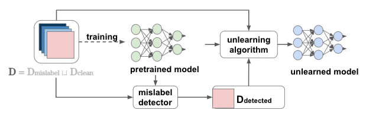

# mislabel-unlearning
The code for the domestic conference paper, "Improving Generalization Performance of Trained Models by Unlearning Mislabeled Data", [16th Forum on Data Engineering and Information Management (DEIM2024)](https://confit.atlas.jp/guide/event/deim2024/top?lang=en).





# How to use
## Installation
- Install dependencies.
```
$ pip install .
```

## Experiments
Perform experiments with the following commands:
- Detection of mislabeled data:
```
$ python3 src/mnist_detection.py
```

- Unlearning mislabeled data:
```
$ python3 src/mnist_unlearning.py
```

- Unlearning detected data:
```
$ python3 src/mnist_pipelnie.py
```

## Customization
- Hyperparameters can be set with command line arguments.
```
$ python3 src/mnist_detection.py --h
usage: mnist_detection.py [-h] [--noise_ratio NOISE_RATIO] [--learning_rate LEARNING_RATE]
                          [--momentum MOMENTUM] [--batch_size BATCH_SIZE] [--num_epochs NUM_EPOCHS]
                          [--hidden_size HIDDEN_SIZE] [--sample_per_class SAMPLE_PER_CLASS] [--mode MODE]
